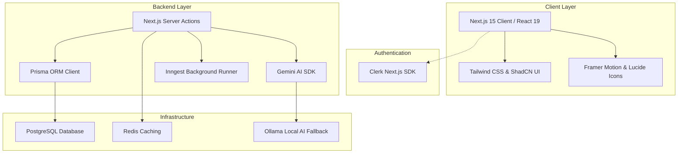
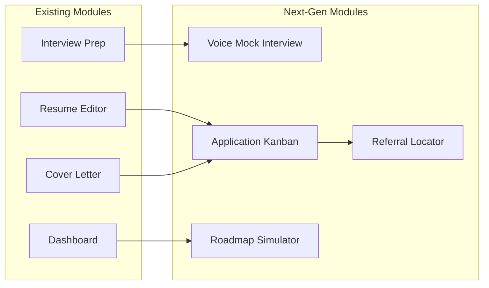

# Rixora Design, Layout & Future Spec

This document details the architectural layout, design aesthetics, stylesheet (CSS) system, technology stacks, and future scopes of the **Rixora** platform. It acts as the blueprint for current maintenance and upcoming development phases.

---

## 1. Core Technology Stack

Rixora is built on a highly performant, type-safe, and asynchronous stack:



| Technology | Layer | Purpose |
| :--- | :--- | :--- |
| **Next.js 15 (Turbopack)** | Framework | Server-Side Rendering (SSR), Static Generation (SSG), and Server Actions. |
| **React 19** | Component UI | Reusable component states and hydration hooks. |
| **Tailwind CSS v3** | Styling Layer | Utility-first css styling and custom color tokens. |
| **ShadCN UI (Radix UI)** | UI Library | Accessible, unstyled primitives (Dialog, Select, Tabs, Accordion). |
| **Framer Motion v12** | Animation | High-performance client-side micro-animations and page transitions. |
| **Prisma ORM (v5.22)** | Database Client | Type-safe queries, transaction handlers, and schema migration manager. |
| **Clerk Authentication** | Identity | Secure multi-tenant authentication, login modal, and session synchronization. |
| **Google Generative AI** | Primary AI | `gemini-2.5-flash` model for resume analysis, ATS scoring, and interview prep. |
| **Ollama Local AI** | Fallback AI | Local `llama3` container to act as a resilient offline backup in development. |
| **Redis (ioredis)** | Cache | Caches expensive AI-generated industry insights with custom TTL logic. |
| **Inngest SDK** | Background Worker | Event-driven background jobs and scheduled Sunday midnight crons. |

---

## 2. Layout & structural Design Architecture

The application layout is divided into three distinct routing structures to separate marketing pages, authenticated workflows, and security entry points:

```txt
my-app/
├── app/
│   ├── layout.js                 # Global Root Layout (Clerk + Theme Provider + Toaster)
│   ├── page.jsx                  # Marketing / Landing Page
│   ├── (auth)/                   # Authentication Pages Layout
│   │   ├── sign-in/
│   │   └── sign-up/
│   └── (main)/                   # Authenticated Application Layout
│       ├── layout.js             # Adds page transitions & padding offset (pt-16)
│       ├── dashboard/            # Industry Insights Dashboard
│       ├── resume/               # Split-Screen Resume Editor
│       ├── interview/            # Mock Interview Quiz Simulator
│       └── ai-cover-letter/      # Cover Letter Builder
```

### A. Root Layout (`app/layout.js`)
* **Shell**:
  - `ClerkProvider` wraps the entire HTML document to enforce global auth state.
  - `ThemeProvider` initializes theme classes (defaults to `dark`).
  - `Toaster` renders dynamic floating popups (`sonner`).
* **Structure**:
  - Global `<Header />` handles page navigation, profile avatars, and growth tools.
  - Global `<main>` wrapper contains the layout routing view.
  - Global `<footer />` displays social links and copyright notices.

### B. Marketing / Landing Page Layout (`app/page.jsx`)
* **Hero Section**: Fixed perspective grid wrapper simulating a dark Command Bar interface.
* **Feature Grid**: 4-column responsive grid displaying cards with hovering focus glows.
* **Stats section**: 4-column metrics block highlighting growth data using high-contrast colors.
* **CTA Block**: Premium bottom gradient strip in grayscale for high readability.

### C. Authenticated App Layout (`app/(main)/layout.js`)
* Wraps all core app modules with:
  - Offset padding top (`pt-16`) to sit below the floating sticky Header.
  - Transition container (`page-transition`) to enable slide-in-up animations.

---

## 3. Styling, Color Tokens & Custom CSS

The design system is built using a hybrid of **Tailwind Utility CSS** and **Vanilla Custom CSS** variables in `app/globals.css`.

### A. Color Tokens (Tailwind Config / CSS Variables)
Rixora relies on HSL color mapping. Standard variables change dynamically depending on the `.dark` class state:

```css
/* Base variables in globals.css */
:root {
  --background: 0 0% 100%;       /* Pure White default */
  --foreground: 0 0% 3.9%;       /* Charcoal Black text */
  --primary: 220 85% 42%;        /* Electric Blue */
  --muted: 210 40% 96.1%;        /* Soft White Gray */
  --border: 0 0% 89.8%;          /* Light Gray borders */
}

.dark {
  --background: 0 0% 3.9%;       /* Pitch Black background */
  --foreground: 0 0% 98%;        /* White text */
  --primary: 220 90% 70%;        /* Electric Sky Blue */
  --muted: 0 0% 14.9%;           /* Matte Gray */
  --border: 0 0% 14.9%;          /* Dark Gray borders */
}
```

### B. Custom CSS Utility Layers

#### 1. Command Grid Overlay (`.grid-background`)
Renders a subtle engineering grid background behind elements:
```css
.grid-background {
  position: fixed;
  top: 0; left: 0; width: 100%; height: 100%;
  background: 
    linear-gradient(to right, rgba(255, 255, 255, 0.05) 1px, transparent 1px),
    linear-gradient(to bottom, rgba(255, 255, 255, 0.05) 1px, transparent 1px);
  background-size: 50px 50px;
  z-index: -1;
  pointer-events: none;
}
.grid-background::before {
  content: "";
  position: absolute;
  top: 0; left: 0; width: 100%; height: 100%;
  background: radial-gradient(circle, transparent 20%, rgba(0, 0, 0, 0.9) 100%);
}
```

#### 2. Onboarding Border Loop Animation (`.form-border-animation`)
Creates a looping rainbow border animation representing AI data scanning:
```css
.form-border-animation::before {
  content: "";
  position: absolute;
  inset: -1.5px;
  border-radius: inherit;
  z-index: -1;
  background: linear-gradient(90deg, rgba(255,255,255,0) 0%, rgba(255,255,255,0.6) 50%, rgba(255,255,255,0) 100%);
  background-size: 200% 100%;
  animation: borderLoop 4s linear infinite;
  mask: linear-gradient(#fff 0 0) content-box, linear-gradient(#fff 0 0);
  -webkit-mask-composite: xor;
  padding: 1.5px;
}
@keyframes borderLoop {
  0% { background-position: 200% 0; }
  100% { background-position: -200% 0; }
}
```

#### 3. Framer Motion Micro-Animations
* **Interactive Section Transition**: `AnimatedSection` delays component loading and slides them up.
* **Button Glow Animation**: Start button uses an absolute electric radial gradient backdrop scaling up on hover.

---

## 4. Next-Gen Modules & Future Scopes

To expand Rixora from an AI utility app into a full-scale AI Career Platform, the following next-generation modules are planned:



### A. Voice/Video Mock Interview Simulator (`/interview/live`)
* **Goal**: Provide real-time, interactive spoken practice interviews.
* **Tech Stack Additions**: WebRTC, Web Audio API, Whispers API (Speech-to-Text), and Gemini Live API.
* **Functionality**: Renders an AI interviewer avatar. The candidate replies using their microphone. The system transcribes the speech, evaluates content delivery (pace, fillers like "umm", tone), and speaks responses back in real-time.

### B. job Application Tracker & Kanban Board (`/tracker`)
* **Goal**: Enable end-to-end job search management.
* **Tech Stack Additions**: `@dnd-kit/core` (Drag and Drop), Chrome Extension API.
* **Functionality**:
  - A Kanban dashboard with stages: *Bookmarked, Applied, Interviewing, Offer, Rejected*.
  - A Chrome Extension allowing users to scrape job listings directly from LinkedIn, Indeed, or Glassdoor with one click, parsing requirements automatically.
  - Connects resumes directly to specific columns to keep custom iterations organized.

### C. Referral Finder (`/networking`)
* **Goal**: Bridge the gap between application and referral.
* **Tech Stack Additions**: Linkedin API integration, AI contact matching.
* **Functionality**: Matches the target company name from the user's cover letter or job tracker against their imported contact network (or suggests potential connection outreach templates if no mutual contact is found).

### D. Career Transition Roadmap Simulator (`/simulator`)
* **Goal**: Outline concrete paths for users looking to switch industries (e.g. from Sales to Product Management).
* **Tech Stack Additions**: Neo4j Graph Database (for plotting career progression paths).
* **Functionality**: 
  - User selects starting role and destination role.
  - AI builds a step-by-step educational curriculum, projects to construct, skills to prioritize, and timeline estimations.

---

## 5. Deployment & System Scalability

### A. CI/CD Pipeline
* **GitHub Actions**: Configured via `.github/workflows/e2e.yml` to trigger on pull requests:
  - Run linting audits.
  - Compile the standalone Next.js build.
  - Launch a Docker stack containing PostgreSQL, Redis, and Ollama.
  - Run Playwright E2E tests and upload screenshot artifacts on failures.

### B. Production Infrastructure
* **Frontend**: Vercel (Next.js serverless architecture).
* **Database**: AWS RDS PostgreSQL.
* **Cache**: Upstash Redis (Serverless).
* **AI Provider**: Google Vertex AI Gemini API endpoint (for enterprise SLAs).
* **Monitoring**: Sentry error reporting & OpenTelemetry logging pipelines.
